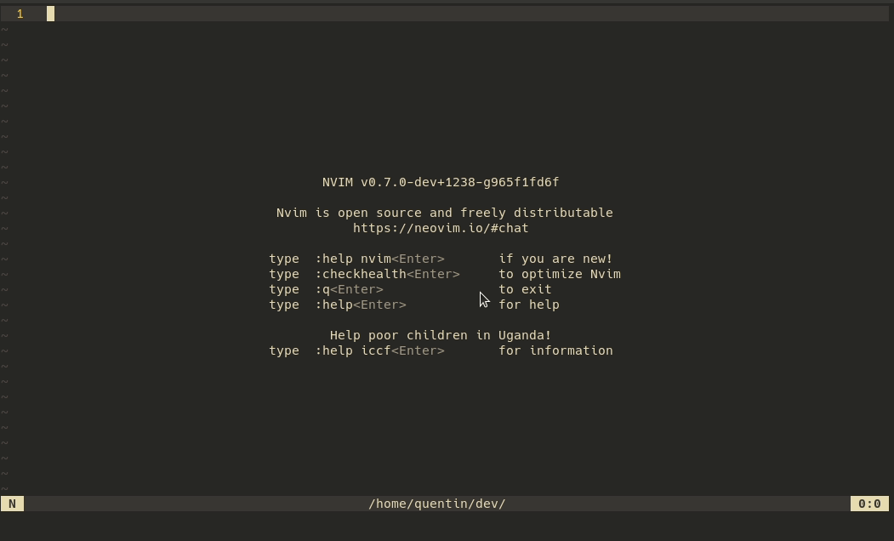
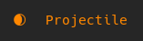
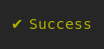
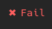

## projectile.nvim

Plugin for projectile.



### Config

Sample config with default values:
```lua
require('projectile').setup{
    output_behavior = 'notify',
    notifier = {
        wait = {
            wait_text = 'Projectile',
            rate = 1000,
        },
        done = {
            success_symbol = '✔',
            success_text = 'Success',
            fail_symbol = '✖',
            fail_text = 'Fail',
            delay = 3000,
        },
        loader = {
            '[.  ]',
            '[.. ]',
            '[...]',
            '[   ]',
        },
    },
    mappings = {
        select_action = 's',
        start = '<CR>',
        quit = 'q',
    }
}
```

#### output_behavior
- "notify"
- "on_exit"
- "on_stdout"

### Highlights
- NotifierText 
- NotifierSuccess 
- NotifierFail 

Can be set with:
```lua
vim.cmd([[highlight NotifierText guifg=#fe8019]])
```

### Acknowledgements

The notifier UI was inspired and borrows implementation from [j-hui/fidget.nvim](https://github.com/j-hui/fidget.nvim)
